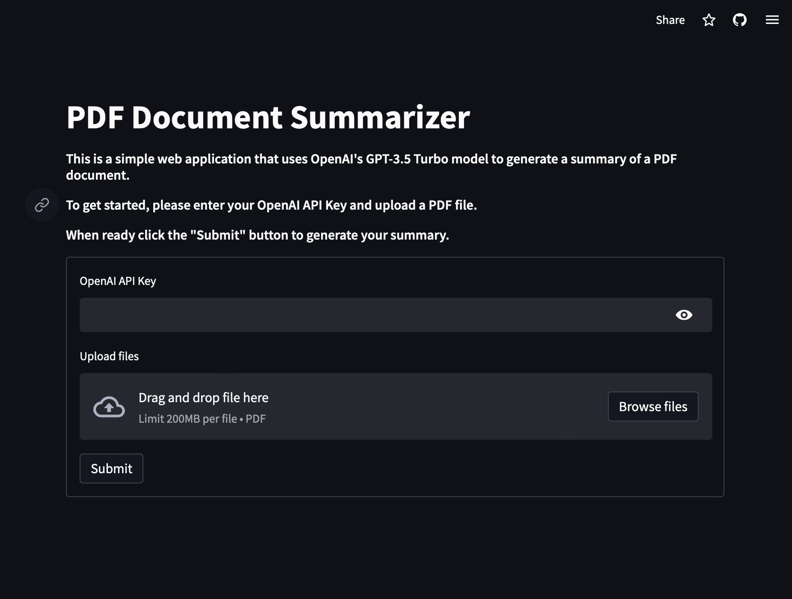

# Simple ChatGPT PDF Summarizer Application

#### Application Link: https://jpschloss-open-ai-summarizer-app.streamlit.app 

## Intro
This is a very simple application developed as part of a lecture for Analytics Vidhya's Data Hour. This session was focused on introducing folks to LLMs in a practical manner and was centered around the building and deploying a base level PDF Summarizer. 

This session worked to introduce OpenAI's API, LangChain, Vector Databases, and deploying on Streamlit. 

Please check out the application at the link above, and please also feel free to check out the session presentation [here](ChatGPTSummarizer.pdf).

#### Thanks y'all and happy coding!